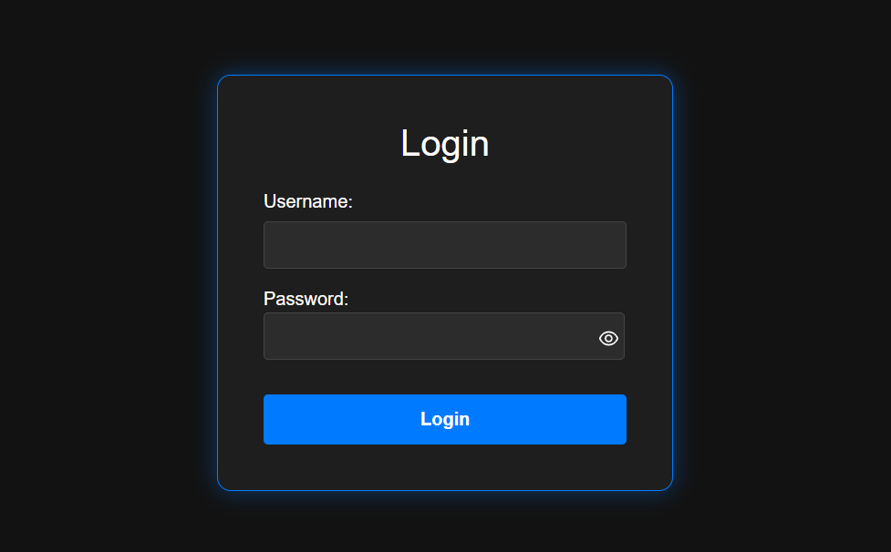
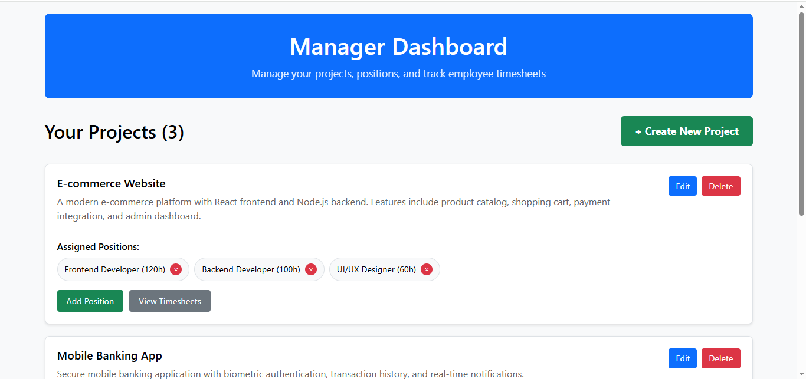
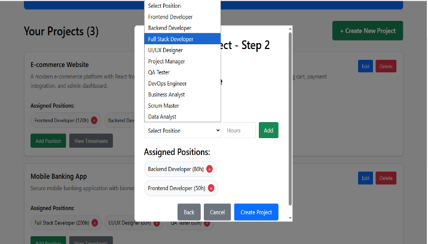
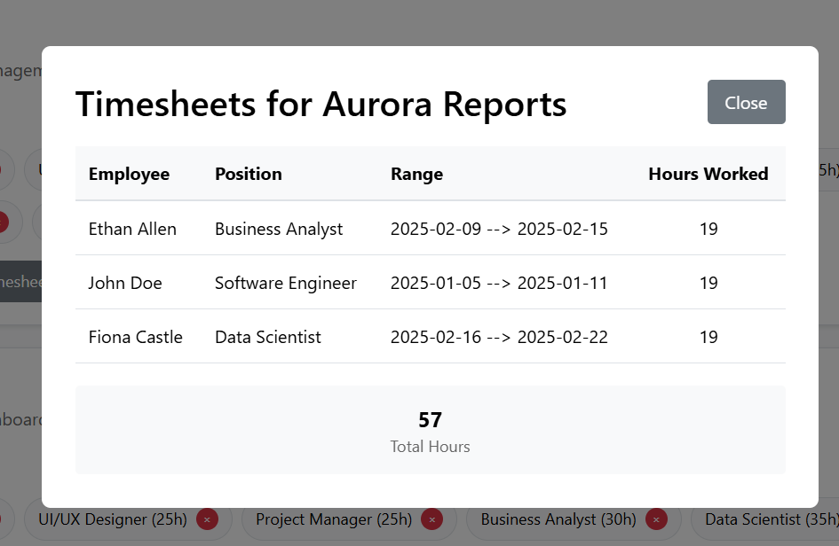
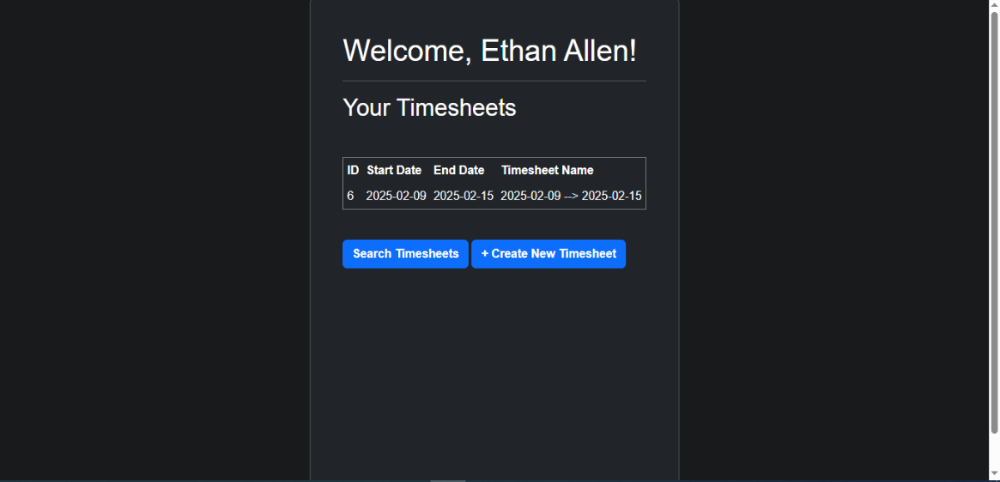
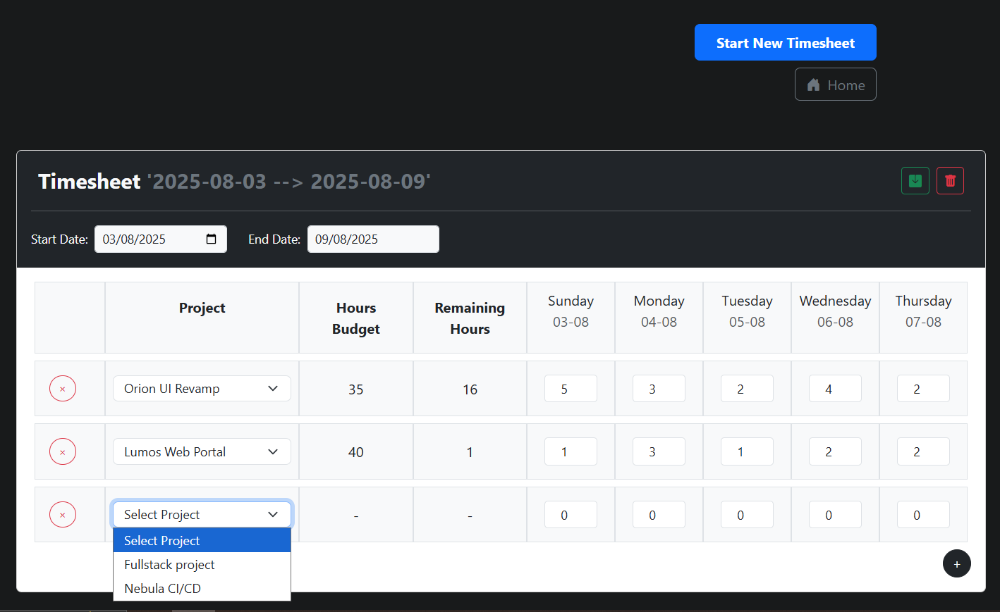
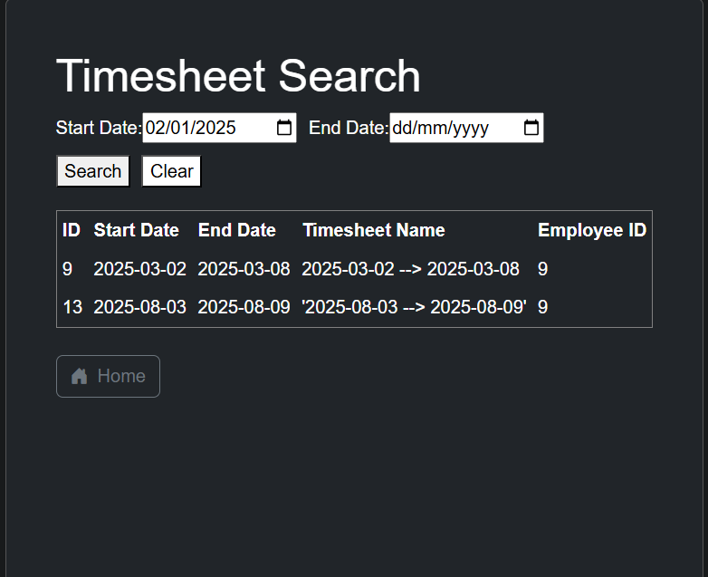

<a id="readme-top"></a>
[](https://www.linkedin.com/in/ibrahim-hesham-abdel-dayem/)

<!-- PROJECT LOGO -->
<br />
<div align="center">
  <a href="https://github.com/ibraaahim11/Collaborative-Text-Editor">
    
  </a>

<h3 align="center">ElSewedy Time Sheets</h3>

</div>

<!-- TABLE OF CONTENTS -->
<details>
  <summary>Table of Contents</summary>
  <ol>
    <li>
      <a href="#about-the-project">About The Project</a>
      <ul>
        <li><a href="#built-with">Built With</a></li>
      </ul>
    </li>
    <li><a href="#getting-started">Getting Started</a></li>
    <li><a href="#usage">Usage</a></li>
    <li><a href="#preview">Preview</a></li>
    <li><a href="#prerequisites">Prerequisites</a></li>
    <li><a href="#installation">Installation</a></li>
    <li><a href="#default-users">Default Users</a></li>
        <li><a href="#license">License</a></li>
  </ol>
</details>

<!-- ABOUT THE PROJECT -->

## <a id="about-the-project"></a>About The Project

This system was developed as part of an internship at Elsewedy Electric to improve project and workforce management. Built using Spring Boot (backend), React (frontend), and Oracle Database, it allows managers to create projects, assign positions with budgeted hours, and track employee timesheets.

Employees can view their assigned projects and submit weekly timesheets, while the system ensures they stay within their allocated hours. By linking positions to salary data, it can help calculate project labor expense.

For more info on using the website: [View User Guide (PDF)](./documents/ElSewedy%20Timesheets%20-%20User%20Guide.pdf)

If you are interested you can checkout the schema we built: [Relational Schema Diagram (PNG)](./documents/relational-schema-diagram.png)

<p align="right">(<a href="#readme-top">back to top</a>)</p>

### <a id="built-with"></a>Built With

## 🛠️ Built With

<!-- ─── Backend ──────────────────────────────────────────────────────────────── -->

[](https://spring.io/projects/spring-boot)
[](https://www.oracle.com/database/)
[](https://www.mysql.com/)

<!-- ─── Tools ───────────────────────────────────────────────────────────────── -->

[](https://www.postman.com/)

<!-- ─── Front-End ───────────────────────────────────────────────────────────── -->

[](https://react.dev/)
[](https://developer.mozilla.org/en-US/docs/Web/HTML)
[](https://developer.mozilla.org/en-US/docs/Web/CSS)
[](https://getbootstrap.com/)

<p align="right">(<a href="#readme-top">back to top</a>)</p>

<!-- GETTING STARTED -->

## <a id="getting-started"></a>Getting Started

Follow these steps so you can run ElSewedy Timesheets locally.

<!-- USAGE EXAMPLES -->

## <a id="usage"></a>📖 Usage

- Log in as a Manager or Employee
- Managers can:
  - Create, edit, and delete projects
  - Assign positions and budgeted hours
  - View submitted employee timesheets
- Employees can:
  - View assigned projects
  - Create and submit weekly timesheets
  - Track total and remaining hours per project
  - Search, view, and edit past timesheets

---

### <a id="preview"></a>🖼️ Preview

### Login Page



### Manager Dashboard



### Create Project



### View Project Timesheets



### Employee Dashboard



### Submit New Timesheet



### Timesheet Search



<p align="right">(<a href="#readme-top">back to top</a>)</p>

## <a id="prerequisites"></a>Prerequisites

Before running this project, make sure you have the following installed on your machine:

**Frontend:**

- [Node.js](https://nodejs.org/) (v16 or higher recommended)
- [npm](https://www.npmjs.com/) (comes with Node.js)
- A web browser (e.g., Chrome, Firefox)
- [Git](https://git-scm.com/) (for cloning the repository)

**Backend:**

- [Java JDK](https://adoptopenjdk.net/) (version 11 or higher recommended)
- [Maven](https://maven.apache.org/) (for building and running the backend)
- [Oracle Database](https://www.oracle.com/database/) or [MySQL](https://www.mysql.com/) (for the backend database)

To verify installation:

```bash
node -v
npm -v
git --version
java -version
mvn -v
```

### <a id="installation"></a>Installation

1. **Clone the repository**

   ```sh
    git clone https://github.com/ibraaahim11/ElSewedy-Time-Sheets.git
   ```

2. **Set up the Oracle Database**

   - Make sure you have Oracle Database installed and running.
   - Create a new database called `Elsewedy_db`.
   - For step-by-step instructions on creating a new user and database, refer to the `creating-new-user.txt` file in the `documents` folder (you can use SQL Developer or another Oracle tool).

3. **Initialize the Database**

   - After creating the new user and database, run the `reset-db-sql.txt` script (also found in the `documents` folder) to set up the required tables and initial data.
   - Dont't forget to commit changes.

4. **Configure and Run the Backend**

   - Open the `backend` folder as a separate project (it is recommended to use IntelliJ IDEA).
   - In `src/main/resources/application.properties`, update the database `username` and `password` to match the new Oracle user you created.
   - Adjust the database `url` if your Oracle DB is running on a different port or host.
   - **After you know the URL of your frontend (e.g., `http://localhost:5173`), go to your backend code and search for `@CrossOrigin`. Change the URL in the `origins` property to match your frontend URL. This allows your frontend to communicate with the backend and is put there for security reasons.**
   - Build and run the backend project.

5. **Install frontend dependencies**

   ```sh
   npm install
   ```

6. **Run the development server**

   ```sh
   npm start
   ```

7. **Open in your browser**

   - Go to the provided URL (usually `http://localhost:5173`) to explore the app.

### <a id="default-users"></a>Default Users

The following users and passwords are available by default after running the `reset-db-sql.txt` script. You can use these credentials to log in as different users for testing or demonstration purposes:

| Username | Password |
| -------- | -------- |
| jdoe     | pass123  |
| asmith   | pass456  |
| bwayne   | pass789  |
| ckent    | superman |
| dparker  | p@ssword |
| eallen   | fast123  |
| fcastle  | hunter42 |
| gsnow    | backloop |
| hwang    | pixel99  |
| ijames   | scrummm  |

You can run the `reset-db-sql.txt` script at any time and then commit the changes to reset the database to its initial state with

<p align="right">(<a href="#readme-top">back to top</a>)</p>

## <a id="license"></a>License

This project is intended for educational purposes only and is not licensed for commercial use or redistribution.

<p align="right">(<a href="#readme-top">back to top</a>)</p>
